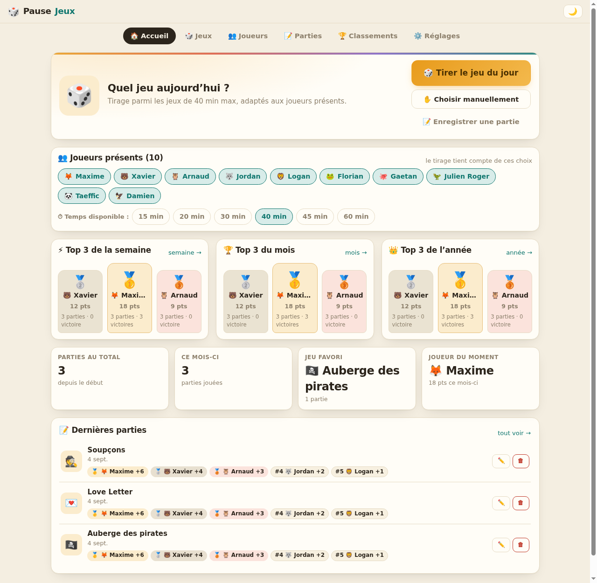
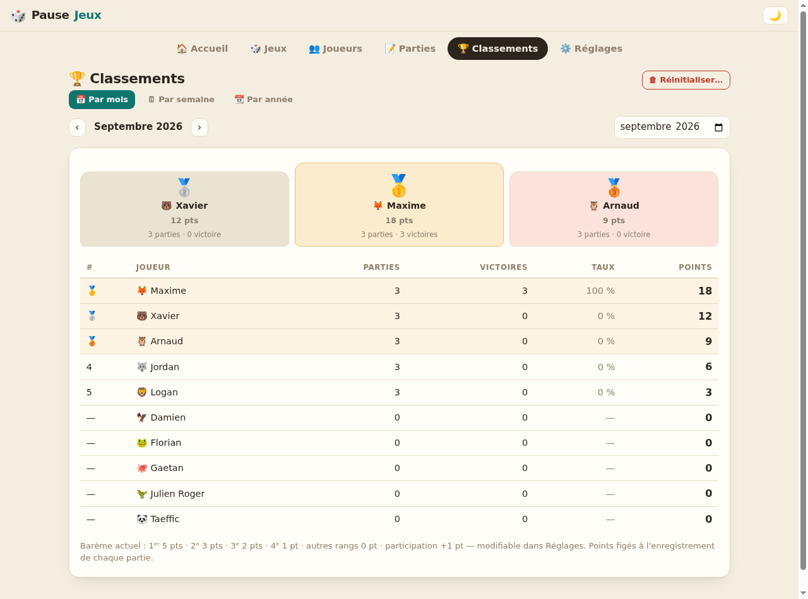

# 🎲 Pause Jeux

Application web pour organiser les pauses jeux de société : tirage au sort du jeu du jour,
enregistrement des résultats en moins d'une minute, classements mensuels et annuels avec historique.

**Zéro dépendance, zéro build** : Node.js ≥ 18 suffit.

| Accueil | Classements |
|---------|-------------|
|  |  |

---

## Lancer en local

```bash
node server.js
# → http://localhost:3000
```

Variables d'environnement (facultatives) :

| Variable   | Défaut    | Rôle                                |
|------------|-----------|-------------------------------------|
| `PORT`     | `3000`    | Port d'écoute                       |
| `HOST`     | `0.0.0.0` | Interface d'écoute                  |
| `DATA_DIR` | `./data`  | Dossier du fichier de données       |

## Tests

```bash
node server.js &        # puis :
node scripts/smoke-test.mjs 3000
```

## Structure

```
server.js            Serveur HTTP (API + fichiers statiques), Node pur
lib/store.js         Persistance JSON (écriture atomique + .bak), validations, points
public/              Frontend vanilla JS (SPA, ES modules, aucun build)
  index.html
  css/style.css      Thème clair « papier » + thème sombre « soirée jeu »
  js/                main.js (routeur), api.js, ui.js, stats.js, part-modal.js
  js/views/          dashboard, jeux, joueurs, parties, classements, reglages
data/db.json         Les données (créé et seedé au premier lancement)
scripts/             Test de fumée de l'API
deploy/              Exemples systemd + Nginx pour la production
```

## Fonctionnement

- **Accueil** : bouton « Tirer le jeu du jour » (animation + confettis). Le tirage ne propose
  que les jeux **actifs** dont la durée ≤ pause et dont la plage de joueurs convient aux **présents**
  cochés. Le jeu du jour reste affiché jusqu'au lendemain.
- **Enregistrer une partie** : cocher les présents → les toucher dans l'ordre d'arrivée → Enregistrer.
  Bouton « Partie coop : tout le monde gagne » (tous rang 1).
- **Points** : barème par rang (défaut : 5/3/2/1 puis 0) + point de participation (défaut : +1).
  Modifiable dans Réglages ; les points sont **figés à l'enregistrement** (le passé ne bouge jamais).
- **Classements** : calculés par semaine (lundi → dimanche), par mois et par année,
  navigation dans toutes les périodes passées. Tri : points, puis victoires, puis taux de victoire.
  Bouton « Réinitialiser » : efface les parties de la semaine, du mois, de l'année affichée ou tout l'historique.
- **Intégrité** : un joueur ou un jeu ayant servi à une partie ne peut pas être supprimé —
  on le **désactive** (masqué, historique intact).
- **Sauvegarde** : tout vit dans `data/db.json` (une copie `data/db.json.bak` est faite avant
  chaque modification). Export/import JSON disponibles dans Réglages.

## Déployer en production

### 1. Installer

```bash
mkdir -p /opt/pause-jeux
cp -r server.js lib public package.json /opt/pause-jeux/
useradd -r -s /usr/sbin/nologin pausejeux 2>/dev/null || true
chown -R pausejeux:pausejeux /opt/pause-jeux
```

### 2. Service systemd

```bash
cp deploy/pause-jeux.service /etc/systemd/system/
systemctl daemon-reload
systemctl enable --now pause-jeux
systemctl status pause-jeux
```

### 3. Reverse proxy Nginx

```bash
cp deploy/nginx-pause-jeux.conf /etc/nginx/sites-available/pause-jeux.conf
ln -s /etc/nginx/sites-available/pause-jeux.conf /etc/nginx/sites-enabled/
nginx -t && systemctl reload nginx
```

Adapter `jeux.mondomaine.fr` dans le fichier de conf. Le serveur écoute sur `127.0.0.1:3000`
via le service systemd ; mettre `HOST=127.0.0.1` dans le service pour n'exposer que Nginx.

### 4. Sauvegarde (cron)

```bash
# Tous les soirs à 23h30 : copie du fichier de données
30 23 * * * cp /opt/pause-jeux/data/db.json /opt/pause-jeux/data/db-$(date +\%Y\%m\%d).json
```

Ou avec `git` dans le dossier `data/` pour un historique complet.

### Sécurité

Outil prévu pour un **LAN de confiance** (bureau) : pas d'authentification. Si vous l'exposez
sur Internet, ajoutez au minimum une *basic auth* Nginx :

```nginx
auth_basic "Pause Jeux";
auth_basic_user_file /etc/nginx/.htpasswd;
```
